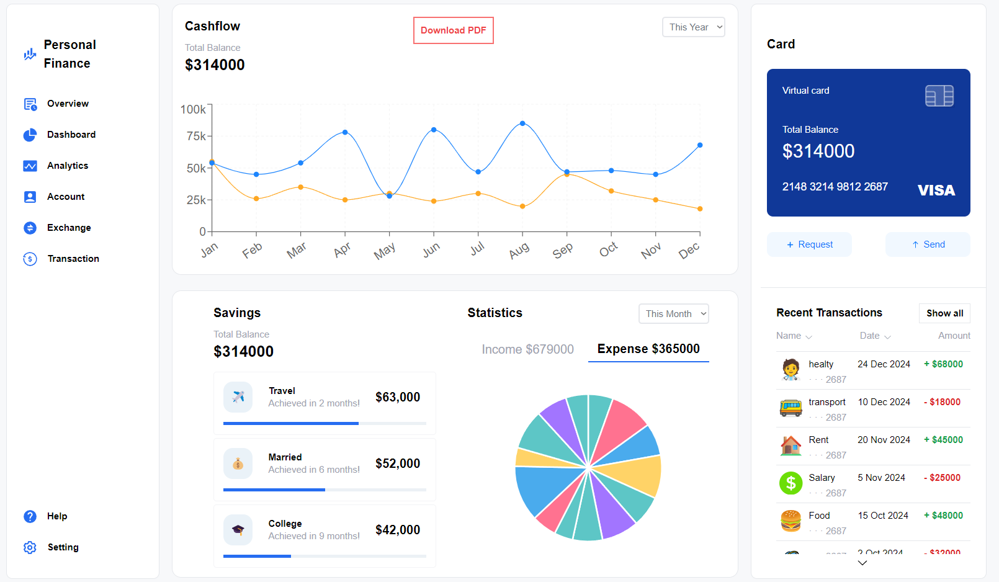
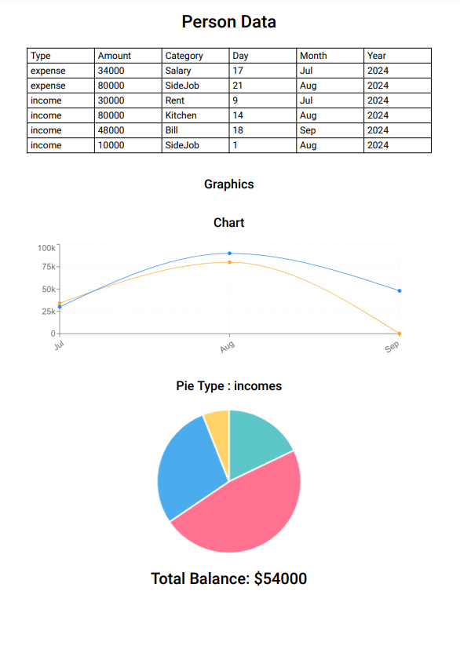
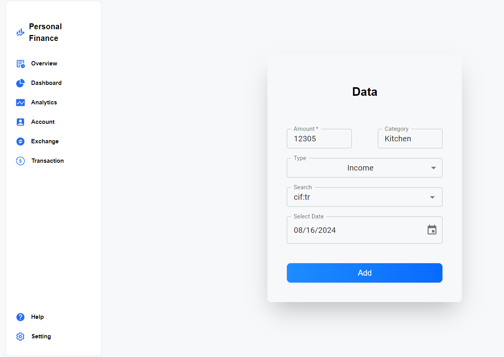
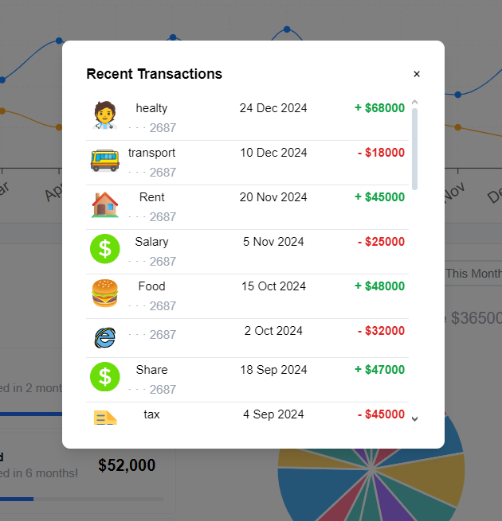
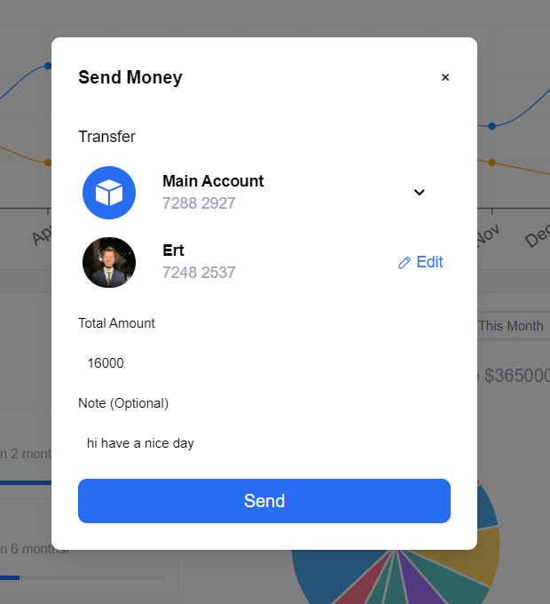

# Personal Finance Tracker 💰📊🗂️


Personal Finance Tracker allows users to manage their expenses, visualize financial data, and generate reports.

## Features ✨

- **💸📈 Expense and Income Tracking**: Users can add their expenses and income, select categories, icons, and dates 
 for each transaction.
- **🗂️✏️ Category Management:** Create and customize categories for better tracking.
- **💸🔄 Money Transfer:** Send money to friends directly within the app.
- **📈📊 Data Visualization:**
  - **📉 Line Chart:** Displays the user's expenses over the years.
  - **📊 Pie Chart:** Shows expenses and income distribution by month.
- **📄🗂️ PDF Export:**
  - 📥 Users can download a PDF report containing:
  - 📋 A table of all past expenses and income.
  - 📈 A graphical view summarizing annual expenses and revenues.
  - 📊 A pie chart of monthly expenses.
  - 💰 Total account balance
- **📱💻 Responsive Design:** The application is fully responsive and works seamlessly on different screen sizes.

## Technologies Used 💻

- 🗃️ [Zustand](https://zustand-demo.pmnd.rs) - State management library.
- 📊 [React Chart.js 2](https://github.com/reactchartjs/react-chartjs-2), [Chart.js](https://www.chartjs.org) - Simple yet flexible JavaScript charting library.
- 🛤️ [React Router](https://reactrouter.com/en/main) - Declarative routing for React applications.
- 🌐 [Axios](https://axios-http.com) - Promise-based HTTP client for making API requests.
- 📄 [Pdfmake](http://pdfmake.org/#/) - JavaScript library to generate PDF files.
- 💻 [React.js](https://reactjs.org/) - JS library for crafting user interfaces
- ⚡ [Vite](https://vitejs.dev/) - Module bundler
- 🎨 [Tailwind CSS](https://tailwindcss.com/) - A utility-first CSS framework
- 🌟 [Iconify](https://iconify.design) - A comprehensive icon library offering thousands of icons for use in web and mobile applications.
- ⚙️ [Material-UI (MUI)](https://mui.com) - React components for faster and easier web development.
- 📸 [html2canvas](https://html2canvas.hertzen.com) - JavaScript library to capture and save screenshots of web content.
- 🌐 [Netlify](https://www.netlify.com/) - Hosting service for static web apps

## Install & Build 🔧

Prerequisites

- Install Node.js ⚙️
- Clone the repo 🔄

📦 After cloning the repo install dependecies with

 ```sh 
  npm i
```
📡 To run development server use dev script
 ```sh 
  npm run dev
```
🔧 To build use build script
 ```sh 
  npm run build
```
after running scripts go to http://localhost:5173 with your browser to use the app. 🌐

  ## Demo  🌐
 [personal-finance-trackerr](https://personal-finance-trackerr.netlify.app) 

## Screenshots 📸
<div>
    <h3>Dashboard 📊📈</h3>
    
</div>
<div style="display: flex; flex-direction: row;">
  <h3>Pdf Document 📄🗂️</h3>
    
  <h3>Data Form 📝✅</h3>
    
</div>
<div style="display: flex; flex-direction: row;">
  <h3>All Recent Transactions 💳🏦</h3>
    
  <h3>Money Transfer 💸🔄</h3>
   
</div>


## License 📄

[MIT](https://choosealicense.com/licenses/mit/)
